# Screenshots

Screenshots for all 3 tasks are shown here.
The folder containing all linked screenshots is at `/docs/screenshots`.

[_Return to README.md_](/README.md)

- [Task 1 - Student/Staff dashboard](#task-1)
- [Task 2 - Author dashboard](#task-2)
- [Task 3 - Librarian dashboard](#task-3)

## Task 1

### "Available Books" Tab

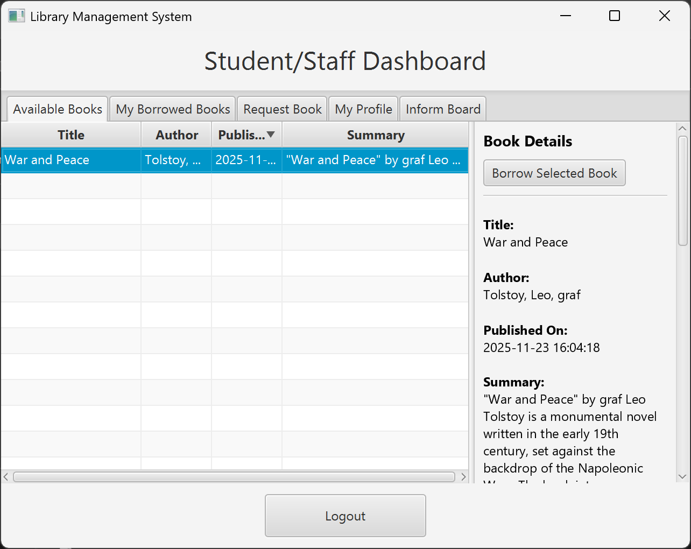

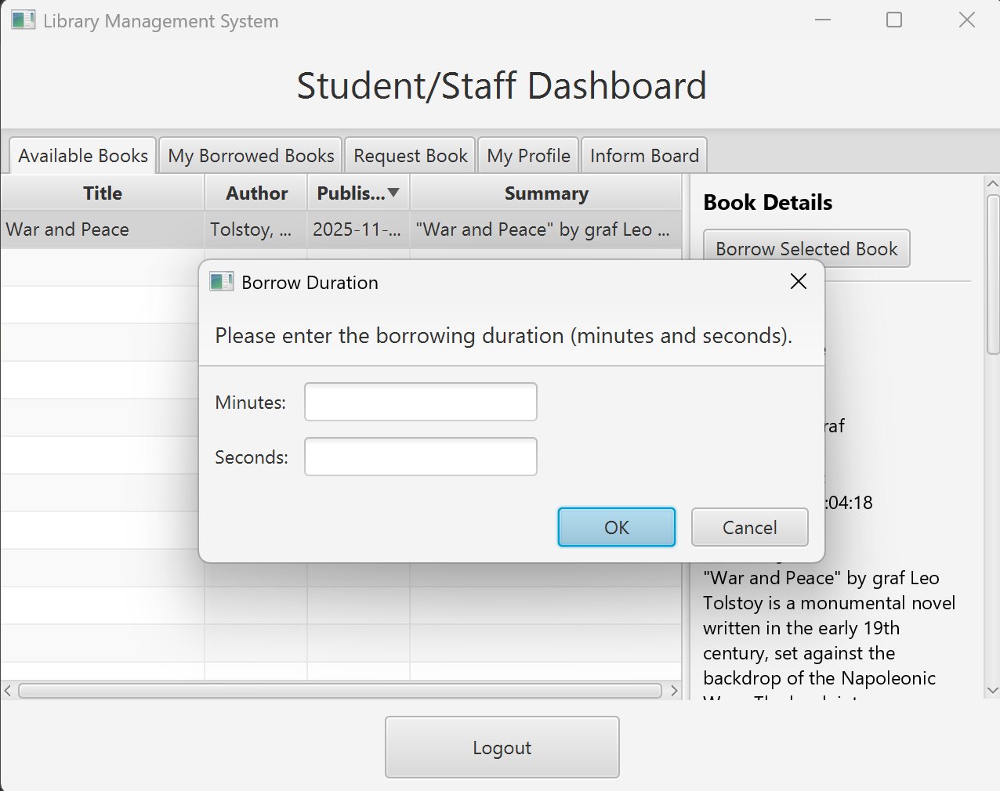
*Dialog that appears after user clicks "Borrow Selected Book" while a row in the table is selected.*

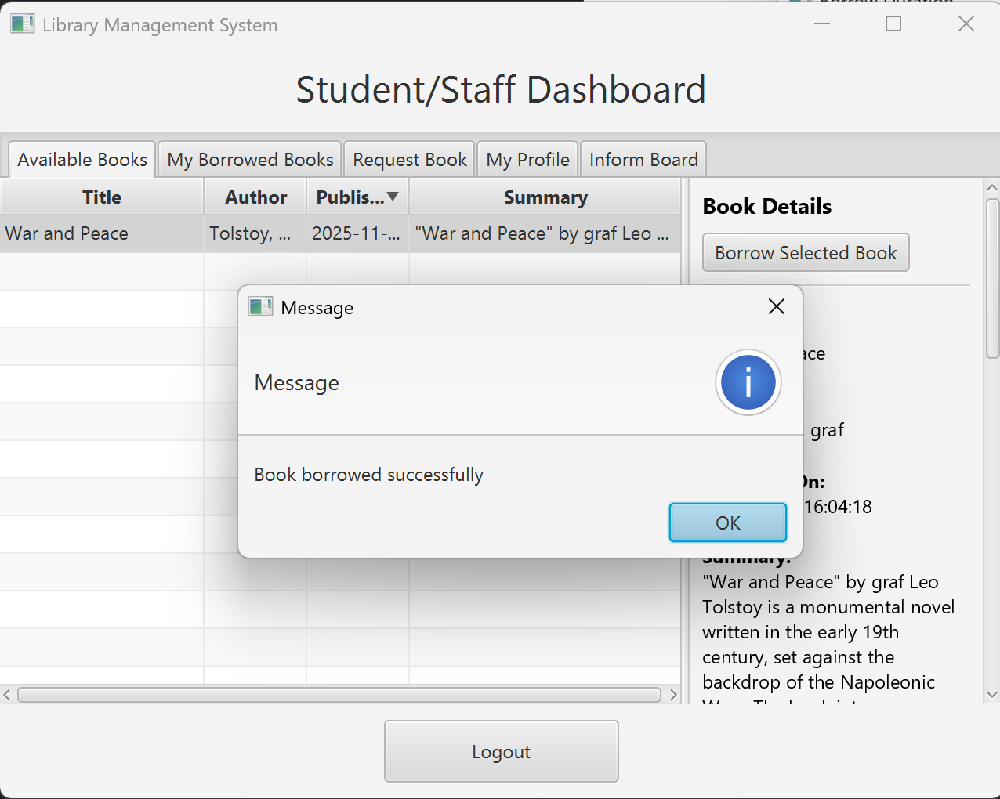
*Message that appears after the user has entered a valid borrow duration (between 0 and 14 days).*

### "My Borrowed Books" Tab

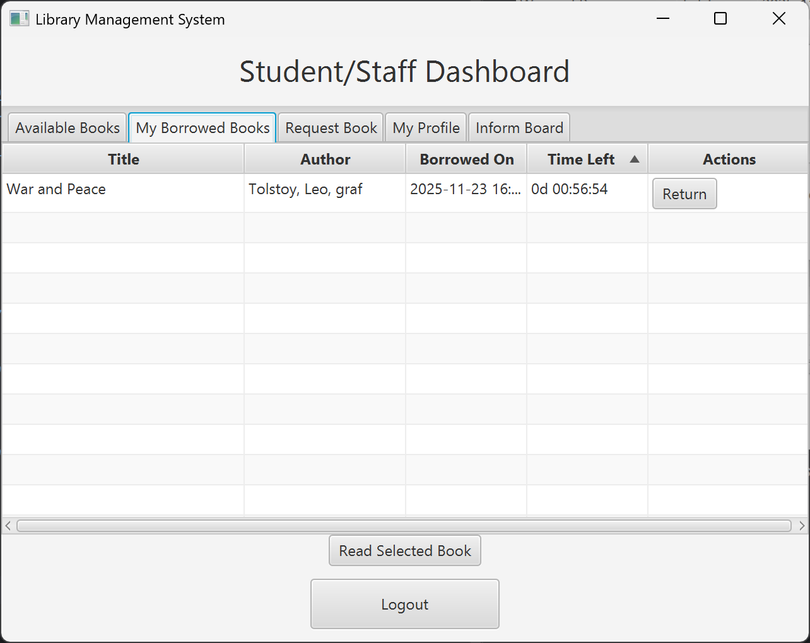

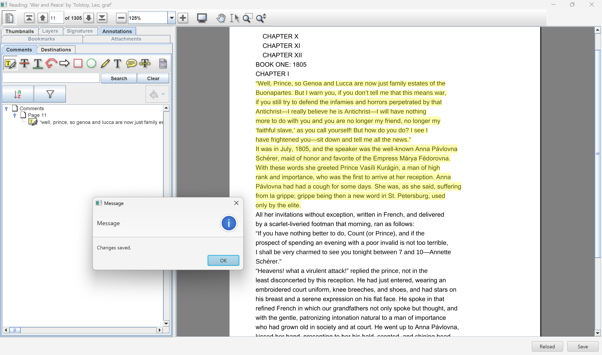
*After clicking "Read Selected Book" while a book is selected in the table shown above,
the user will be able to read a book in PDF format.
Note that the user is able to add various annotations by selecting annotations in the left menu. 
Furthermore, the user is able to reload and save their changes by clicking the buttons at the bottom.*

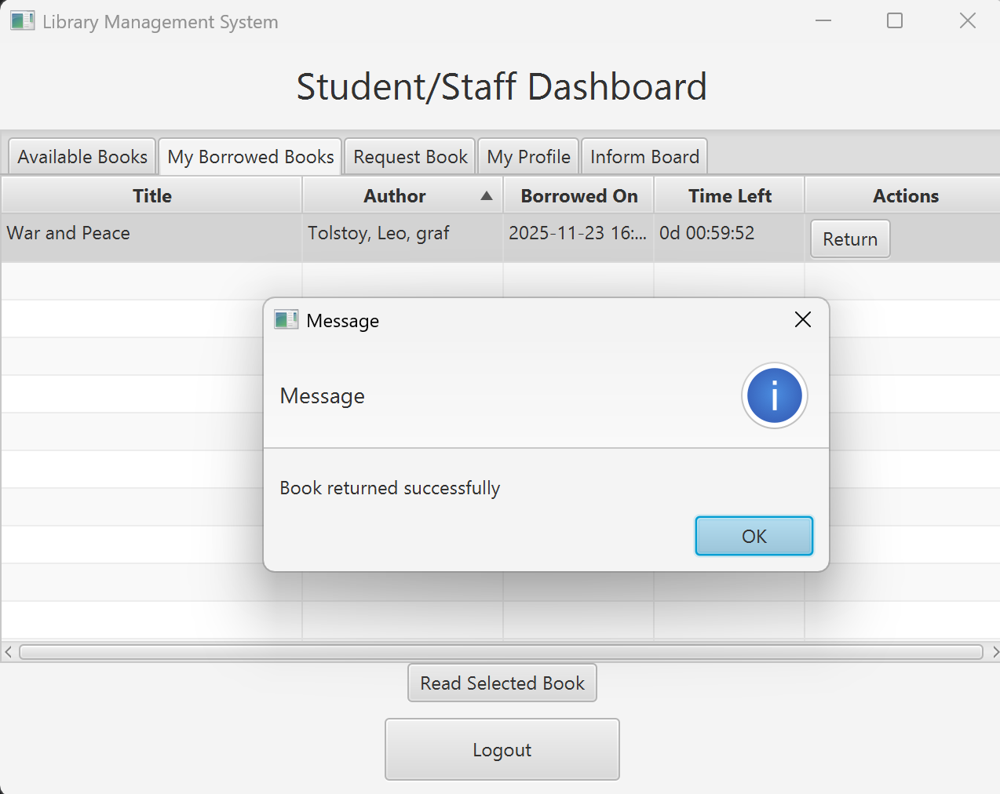
*Message that appears after user clicks "Return" for one of the books in the table.*

### "Request Book" Tab

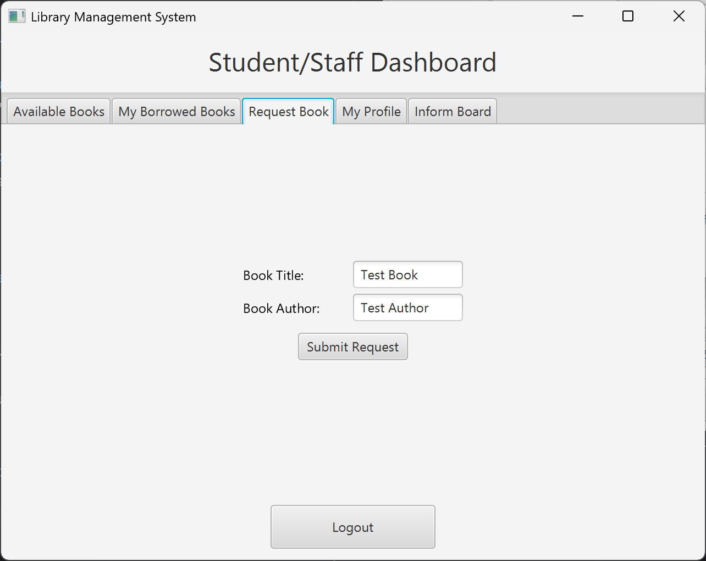

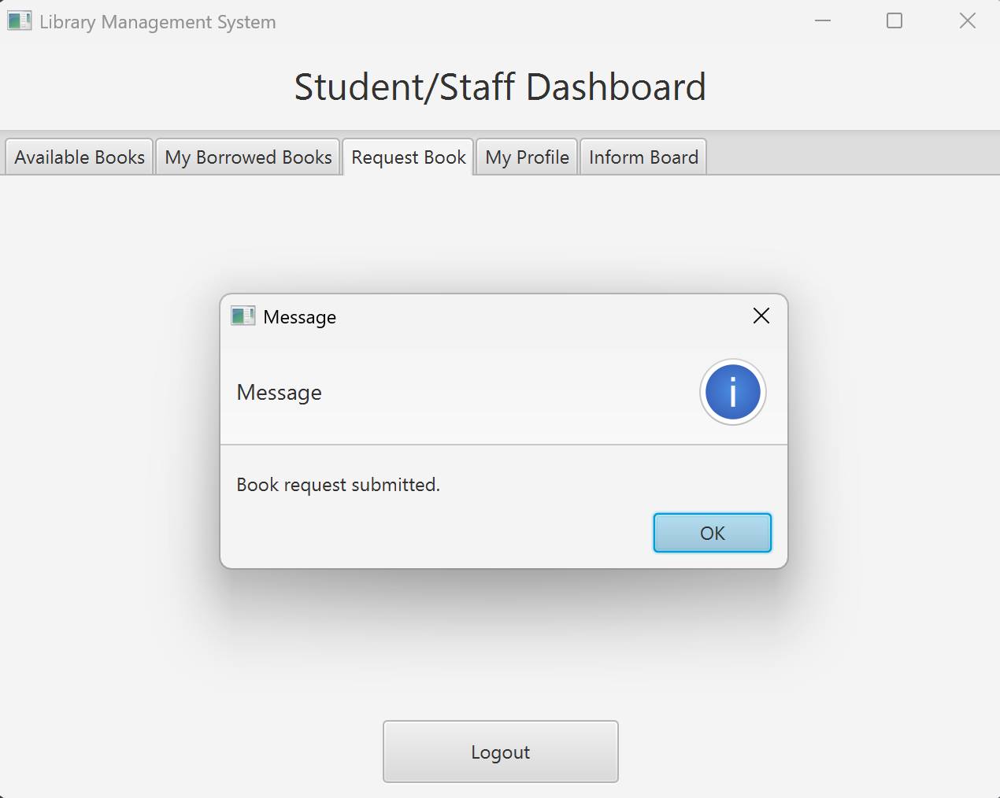

### "My Profile" Tab

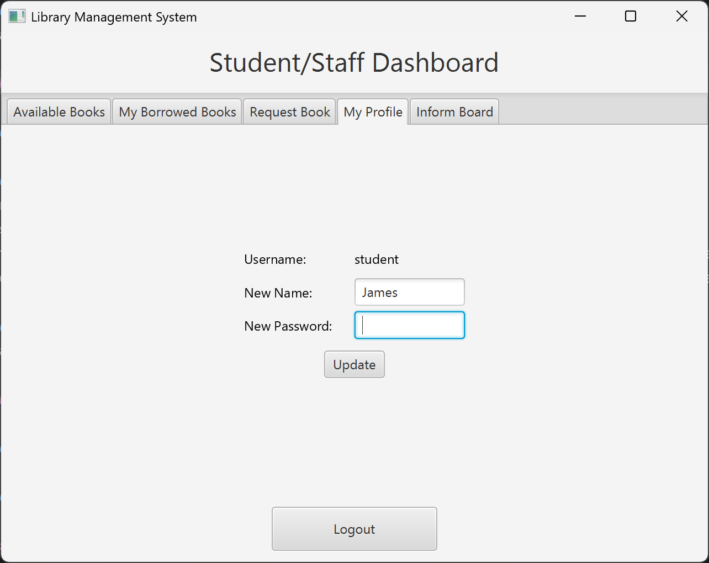
*If one of the input fields is empty, only the other field will be updated when user clicks "Update".*

### "Inform Board" Tab

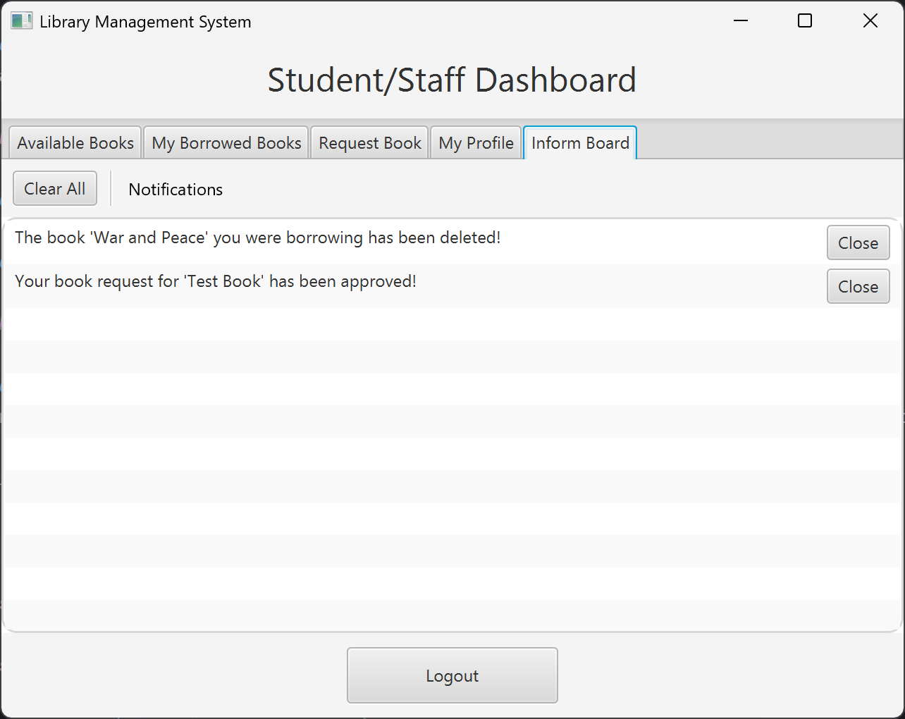
*Two example notifications:
one for when borrowed book is deleted by librarian, and the other for approval of book request.*

## Task 2

## Task 3

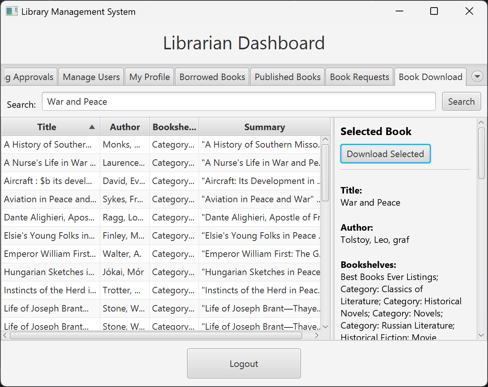